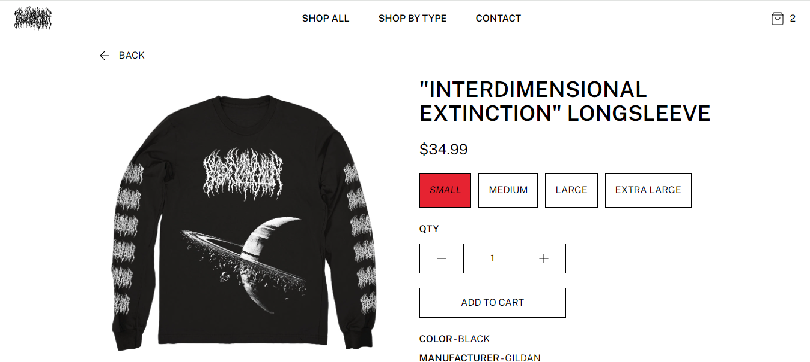

# Blood Incantation Web Store

## Table of Contents

- [Overview](#overview)
- [Built With](#built-with)
- [Features](#features)
- [Acknowledgements](#acknowledgements)

## Overview

[Live Demo](https://fakebloodstore.xyz)

I was looking for a project to practice using TypeScript with React, and my
passion for band merch led me to this e-commerce site for the band Blood
Incantation. The overall design is based heavily on the web store for Evil
Greed, a European metal/extreme music distributor.

This project gave me a better understanding of TypeScript, React custom hooks,
and the Stripe API. This is also my first project hosted on AWS, which I hope to
learn more about on future projects.

For developers working on similar Stripe integrations, I wish I knew ahead of time
how tricky / limiting the styling of Stripe forms can be. Without a lot of
control via CSS, I spent a lot of time modifying my own forms to match Stripe's
available styles.

### Built With

- [React](https://react.dev/)
- [TypeScript](https://www.typescriptlang.org/)
- [Tailwind CSS](https://www.tailwindcss.com)
- [Stripe](https://www.stripe.com)

## Features

- All Items Page - Users can sort all items by name or date and filter by product type.
  If the filter produces more than 12 items the displayed items are paginated.
- Product Type Pages - Users can also navigate via product type pages in the header.
  These pages filter items by the specified product type, ex: "Longsleeves" page only shows
  longsleeve shirts.
- Cart - User's cart is saved in local storage in case they navigate to a different site.
  Item quantities can be updated via the Cart Page before checkout.
- Stripe Checkout - Users can pay via credit card using the Stripe API. The Stripe account
  remains in "test mode" so that payments are not actually processed. An email with all
  order data is sent to an admin email account on each successful order.
- Contact Form - Contact form uses AWS SES to send emails to an admin email account.

## Acknowledgements

I learned how to host this site on AWS from [this video](https://www.youtube.com/watch?v=lPVgfSXTE1Y&t=472s) by Sam Meech-Ward.
